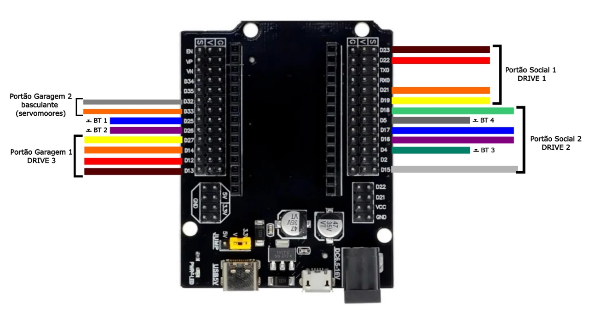
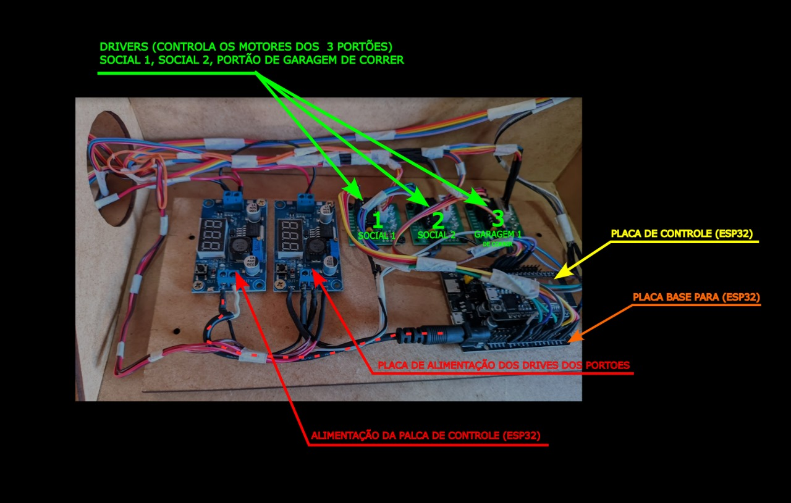

MaqueteESP32 - Sistema de Controle de Portões

Este projeto implementa um sistema de controle para portões e mecanismos motorizados utilizando um ESP32 com MicroPython. O sistema controla 3 motores de passo (stepper motors) e 2 servomotores para operar diferentes portões em uma maquete.

## Características

- Controle de 3 motores de passo para portões
- Controle de 2 servomotores sincronizados
- Interface com 4 botões para acionamento
- Configuração persistente dos tempos de rotação
- Sistema anti-bounce para os botões
- Multitarefa usando threads

## Hardware Necessário

- ESP32 (rodando a 240MHz)
- 3 motores de passo com seus drivers
- 2 servomotores
- 4 botões com resistores pull-up
- Fonte de alimentação adequada

## Diagrama e Componentes

### Diagrama Elétrico

*Diagrama de conexões elétricas do sistema de controle de portões*

### Componentes Utilizados

*Placas e componentes utilizados na montagem do sistema*

## Pinagem

### Motores de Passo
- Motor 1: Pinos 23, 22, 21, 19
- Motor 2: Pinos 18, 17, 16, 15
- Motor 3: Pinos 13, 12, 14, 27

### Servomotores
- Servo 1: Pino 32 (invertido)
- Servo 2: Pino 33

### Botões
- Botão 1: Pino 25 (controla output1)
- Botão 2: Pino 26 (controla output2)
- Botão 3: Pino 4 (controla output3)
- Botão 4: Pino 5 (controla output4 - servomotores)

## Funcionamento

1. Ao pressionar um botão, o sistema aciona o portão correspondente
2. Os motores de passo giram em uma direção por um tempo configurável, pausam, e depois giram na direção oposta
3. Os servomotores se movem de forma sincronizada de 0° a 75° e depois retornam à posição inicial
4. As configurações de tempo de rotação são salvas em um arquivo JSON

## Instalação

1. Instale o firmware MicroPython no ESP32
2. Carregue o arquivo `main.py` para o ESP32
3. Reinicie o dispositivo

## Configuração

O sistema salva as configurações de tempo de rotação dos motores no arquivo `motor_config.json`. Se o arquivo não existir, valores padrão serão utilizados.

## Logs

O sistema gera logs detalhados sobre seu funcionamento, que podem ser visualizados através da conexão serial.

## Observações

- O sistema utiliza a frequência máxima do ESP32 (240MHz) para melhor desempenho
- O servomotor no pino 32 opera em modo invertido (180° - ângulo)
- O sistema implementa debounce para evitar múltiplos acionamentos acidentais

## Solução de Problemas

Se os motores não estiverem funcionando corretamente:
- Verifique as conexões físicas
- Confirme se a alimentação é adequada
- Verifique os logs para identificar possíveis erros